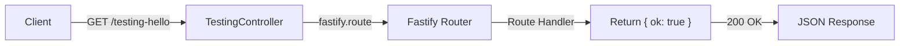

# Testing Hello Endpoint Architecture

## Overview

Simple GET endpoint at `/testing-hello` that returns `{ ok: true }` for API health checking and testing connectivity.

## Design Decisions

| Decision | Rationale |
|----------|-----------|
| **Stateless endpoint** | No persistence needed; used for testing and monitoring only |
| **No schema validation** | Request has no parameters or body; response is static |
| **Synchronous handler** | No I/O operations; immediate response |
| **Auto-loaded controller** | Follows existing pattern with other controllers; automatic registration |

## Architecture



## Components

- **TestingController** (`core/api/src/controllers/testing.controller.ts`)
  - Registers GET route at `/testing-hello`
  - Handler returns `{ ok: true }`
  - Auto-loaded via `@fastify/autoload` plugin

## API Contract

**Endpoint**: `GET /testing-hello`

**Response** (200 OK):
```json
{
  "ok": true
}
```

**Use Cases**:
- Health check for load balancers
- Connectivity testing
- API availability monitoring

## Testing

- **Unit Tests**: Route registration, handler response, HTTP method validation
- **Integration Tests**: Full HTTP request/response flow, status codes, headers, error handling
- **Performance**: Response time < 100ms (no database interaction)

## Integration

The endpoint is automatically loaded via Fastify's `@fastify/autoload` plugin:
- No changes to `app.ts` required
- Auto-discovered from `core/api/src/controllers/` directory
- Immediately available on API startup

## Security Considerations

- No authentication required (testing utility)
- Returns no sensitive data
- Safe to expose publicly
- No database queries or external calls
